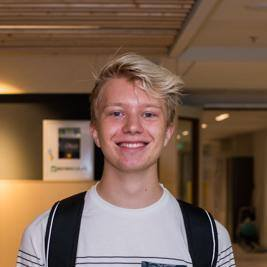

Aside
================================================================================

{width=75%}

Contact Info {#contact}
--------------------------------------------------------------------------------

- <i class="fa fa-envelope"></i> larsdgrt@gmail.com
- <i class="fa fa-github"></i> [github.com/Larsdegroot](https://github.com/Larsdegroot)
- <i class="fa fa-phone"></i> 06 36395468
- <i class="fas fa-map-marker-alt"></i> Uithof, Utrecht

Vaardigheden {#skills}
--------------------------------------------------------------------------------

- <i class="fas fa-language"></i> **Gesproken taal:**
- Nederlands <i class="fas fa-square"></i> <i class="fas fa-square"></i> <i class="fas fa-square"></i> <i class="fas fa-square"></i> <i class="fas fa-square"></i>
- Engels <i class="fas fa-square"></i> <i class="fas fa-square"></i> <i class="fas fa-square"></i> <i class="fas fa-square"></i> <i class="fas fa-square"></i> 

- <i class="fas fa-pen-alt"></i> **Geschreven taal:**
- Nederlands <i class="fas fa-square"></i> <i class="fas fa-square"></i> <i class="fas fa-square"></i> <i class="fas fa-square"></i> <i class="fas fa-square"></i>
- Engels <i class="fas fa-square"></i> <i class="fas fa-square"></i> <i class="fas fa-square"></i> <i class="fas fa-square"></i> <i class="fas fa-square"></i>

- <i class="far fa-file-code"></i> **Programeer taal:**
- Bash <i class="fas fa-square"></i> <i class="fas fa-square"></i> <i class="far fa-square"></i> <i class="far fa-square"></i> <i class="far fa-square"></i>
- R    <i class="fas fa-square"></i> <i class="fas fa-square"></i> <i class="fas fa-square"></i> <i class="far fa-square"></i> <i class="far fa-square"></i> 

Disclaimer {#disclaimer}
--------------------------------------------------------------------------------

Je kan deze CV ook [online vinden!](https://larsdegroot.github.io/CV/)  
Laatst geupdate op: `r Sys.Date()`.

Main
================================================================================

Lars de Groot {#title}
--------------------------------------------------------------------------------

Een gedreven student met een passie voor biologie en technologie. Mijn interesses liggen bij genetica, moleculaire biologie, data science, programmeren en planten. Als hobby kweek ik zeldzame planten in een zelfgemaakte kas. 

Opleiding {data-icon=graduation-cap data-concise=true}
--------------------------------------------------------------------------------

### Havo - Openbaar Lyceum Zeist

Profiel: Natuur en Gezondheid, met Natuurkunde

Zeist

2013 - 2018

### HBO Life science – Hogenschool Utrecht

Afstudeer richting: Biomoleculair research

Utrecht

2018 - Heden

- Minor: Data science for biology

<i class="fas fa-vial"></i> Project Ervaring 
--------------------------------------------------------------------------------

### Moleculaire biologie

HU Institute for Life Sciences & Chemistry 

Utrecht

2020 

- Onderzoek naar functie van een glucocorticoïde receptor d.m.v. expressie vector.
- Ervaring opgedaan in Recombinante DNA technieken en experimental design.

### Xylitol productie door middel van Aspergillus niger

In samenwerking met het Westerdijk Instituut

Utrecht

2020 - 2021

- Xylitol productie van een Aspergillus niger mutant onderzocht.
- Ervaring opgedaan in het kweken van schimmels en homogenisatie methoden

### Data science for biology

in samenwerking met het Prinses Máxima Centrum

Utrecht

2021 - heden

- Het ontwikkelen van Rshiny appvoor het genereren van metadata files van high throughput screening experiments.
- Ervaring opgedaan in Rshiny webapps programeren 
  

Werk ervaring {data-icon=suitcase}
--------------------------------------------------------------------------------

### Schoonmaker

UMC Utrecht

Utrecht

2018

- Schoonmaken van de hoofdingang en radiologie afdeling van het UMC.

### Barista

Barista cafe Zeist

Zeist

2020 - heden

- Barista medewerker met leiding gevende taken.

