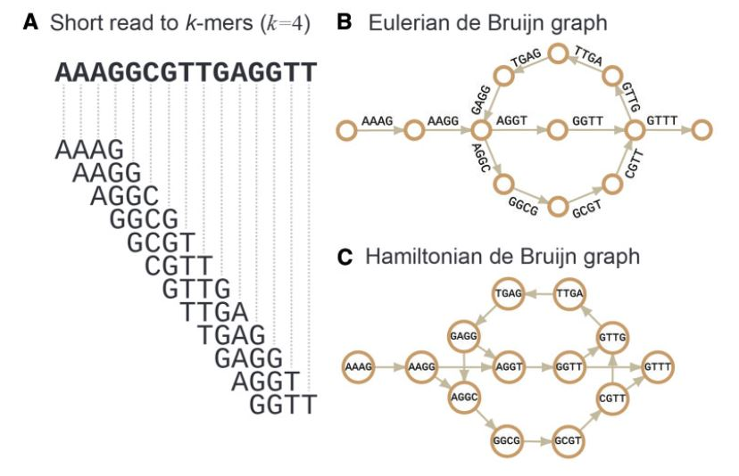

# Portfolio assignment 6.2

In two years time i'd like to be doing a masters in bioinformatics. i've found that i enjoy the act of writing code and coming up with systems, and a higher degree in bioinformatics would allow me to land a job that would include this kind of work. Also my interest in research lies with how i view the potential of technology. I tend to see the potential of innovative research, what it could lead too. and this motivates me to want to work on projects that could lead to exciting advances.  

One branch of technology that has captured my interest in such a way is the possibilities of fast and cheap sequencing. after a masters in bioinformatics i'd like to work on projects that aim to improve sequencing accuracy. This goal requires me to research de novo assembly, consensus algorithms and the current state of sequencing technology.

As an exercise ill summarize the information i have found regarding these subjects.

The current state of NGS lies mostly with three separate systems for sequencing: Illumina with its HiSeq system, Ion torrent with its pyrosequencing and a third generation sequencer the oxford nanopore. These three all rely on different chemistry and methods to decode a DNA strand. 
The principal of a illumina sequencer is that the DNA library with adapters gets grafted to a flow cell. These single strands of DNA get amplified by bridge amplification. this creates clusters of clonal DNA strands. then the actual sequencing step begins by synthesizing the antiparalel strand, with nucleotides that contain cleavable fluorescent dyes. A nucleotide gets implemented, the flowcell gets scanned for fluorescence, the fluorescense dye gets cleaved. this step repeats until the entire strand of dna is sequenced.
A ion torrent sequencer relies on the detection of pyrophosphate released during the incorporation of a nucleotide. DNA strands are captured by beads and amplified with emulsion PCR. Now beads with multiple clonal strands of DNA will be washed over a well plate, a single well can only hold a single bead. a solution of one of the nucleotides get washed over this well plate. A nucleotide gets implemented and pyrophosphate gets released equal to the amount of nucleotides implemented. pyrophosphate gets detected via a luciferase reaction, which generates light.
the Nanopore sequencer get it's name from the tiny biopores it used to detect the sequence of a DNA strand. These pores are embedded on a lipid bilayer which facilitates ion exchange. A nucleotide moving through the pore causes a disruption of the voltage over this pore, which is detected. By moving a a single stranded DNA strand through the pore current modulation is recorded. this current modulation is then used to determine the sequence of the DNA strand. [@generic]

After data is collected there still is the problem of creating an actual genome/sequence out of it. Creating a whole genome out of just sequencing data without a reference genome is called whole genome de novo sequencing assembly. The basic process is: overlapping reads to form contigs, large stretches of consensus sequences without gaps. Then a scaffolding phase in which the order of the contigs is determined by large-insert reads.[@web_page] And a final gap filling stage where gaps between contigs can be 'filled' using remaining short reads. however a de novo assembly is different based on which sequencing technology is used. For Illumina with it's short reads a de Bruijn graph is most commonly used.

A de bruijn graph simplifies the contig creation step for a computer. Instead of having to keep the data of each read sequence in memory, and with what reads it overlaps, It divides reads up in K-mers. It hold a single K-mer of  each unique K-mer in memory. To remember the sequence a path between K-mers is made, if a k-mer repeats the path loops back. To determine overlap a score can be made based on the amount of overlapping k-mers. This improves one of the big challenges of de novo assembly; the great amount of computational power and time required to make such a assembly. 

However de novo assembly using short reads comes with a problem. Genomes contain long repeating sequences that can't be bridged by short reads. Tactics to solve this is using large insert reads or using single molecule sequencer reads, such as the reads from the nanopore sequencer. Large insert reads are short reads that are the tips of a larger fragment. By using a technique in the lap these fragments are of a certain determined size. And by ligating special adapters to them they can later be identified. So during assembly when these reads show overlap between two contigs the distance between these contigs can be estimated. This technique creates a more complicated de bruijn graph however. Using a hybrid approach of short illumina read and long nanopore reads tend to create a simpler graph, and thus shortens computational time. [@article]

A assembly using only long reads is also possible, and seems to be where the future of the technology lies. Assembly using only long reads goes to the same steps of contig creation and scaffolding. However since reads are so long contigs can be the size on an entire chromosome so scaffolding won't be needed.

